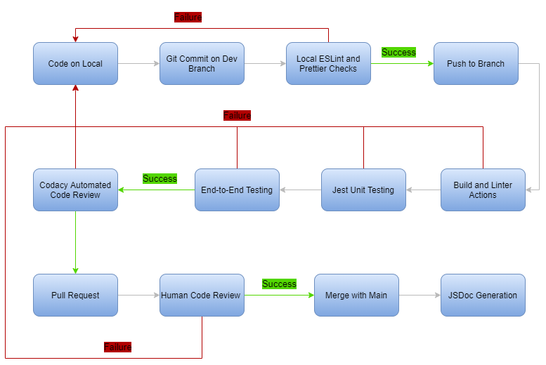

## CI Pipeline: Phase 2 (5/25/2021)

For Phase 2, our pipeline, we currently use ESLint and Prettier for our linters, JSDoc with the Airbnb style guide for Javascript configuration, Codacy for automated code quality review, and Jest for testing. We decided to remove Travis CI for building and testing our code because we felt that we can have the same functionality by just using Github Actions to run our builds and tests. As of right now, we have the actions set up for testing, but we just need to implement them as our project progresses. Below we have our pipeline for Phase 2.

