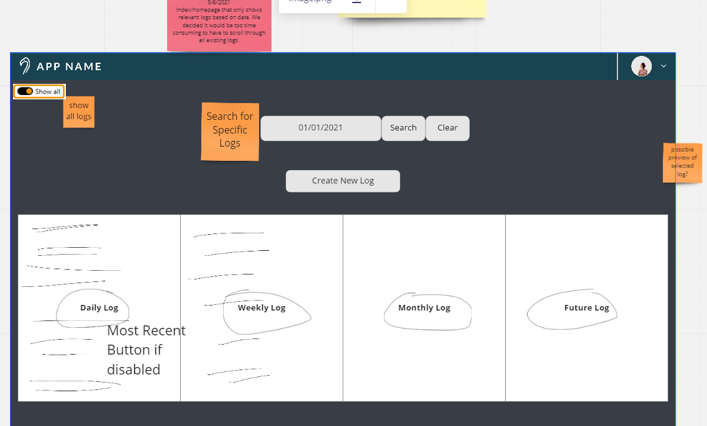
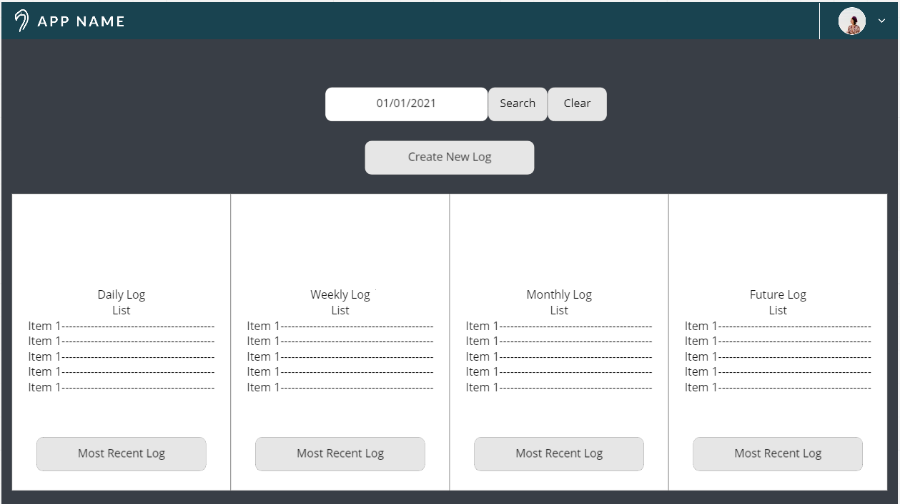

# Landing Page Design

* Status: accepted
* Deciders: Everyone
* Date:  5/5/2021

## Context and Problem Statement

We landed on two different designs for the Landing page. Each had their own unique components.

## Considered Options

* Design with a show all button

* Design without a show all button

## Decision Outcome

Chosen option: Design without a show all button, because it is simpler to implement, and in a way is just a step before Option 1. If we can implement option 2, adding a little bit of logic will create option 1.

### Positive Consequences <!-- optional -->

* Easier for us to code with limited time
* More intuitive for users

### Negative Consequences <!-- optional -->

* Gives too much useless information that users may not want to always see

## Pros and Cons of the Options <!-- optional -->

### [Option 1] With show all

* Good, because easy to code
* Good, because easy to understand
* Good, becuause gives user more freedom to see all logs
* Bad, because all logs can be overwhelming, or unecessary

### [option 2] Without Show all

* Good, because you can hide unecessary logs
* Bad, because not very intuitive
