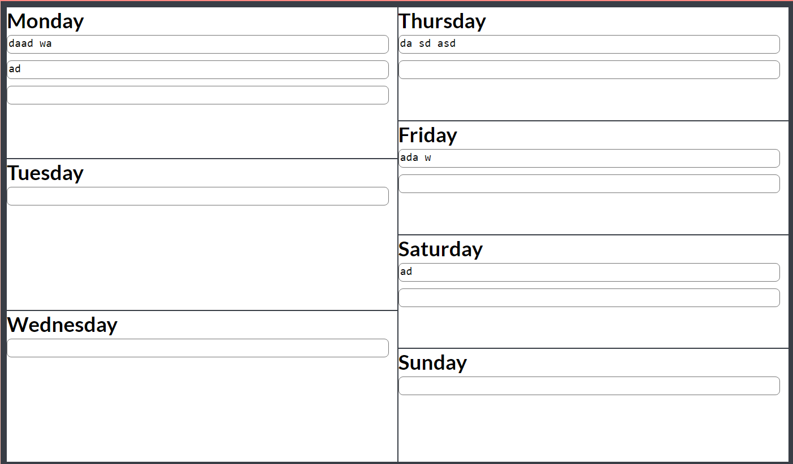
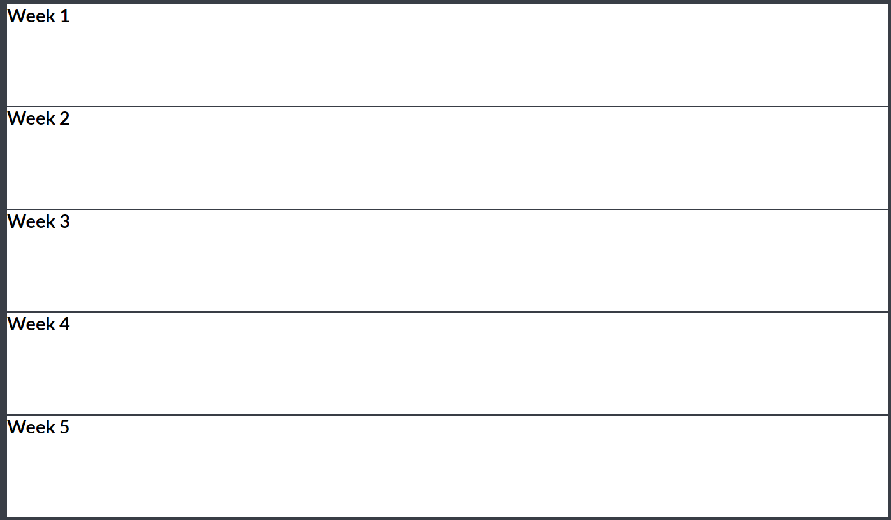

# Storage Architecture Version 2

* Status: Accepted
* Deciders: Amal, Matthew, Kunal
* Date:  6/3/2021

## Context and Problem Statement

We designed the monthly view to have 5 rows, however we realized that when the website became functional, there is very little space to write in each week.
We decided to format it similar to the weekly view, with 2 columms to give more vertical space.

## Old View

## New View
