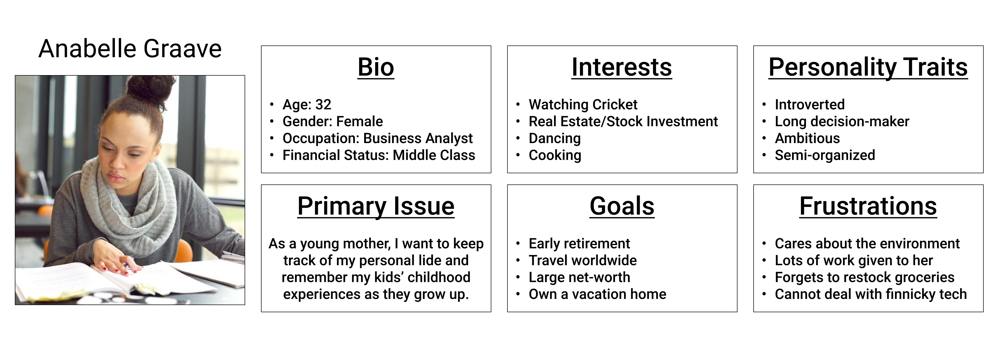
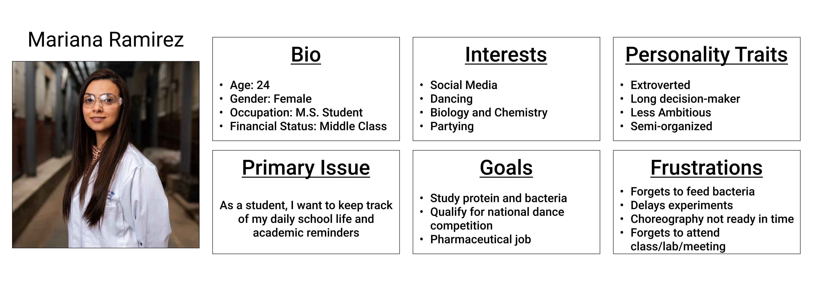
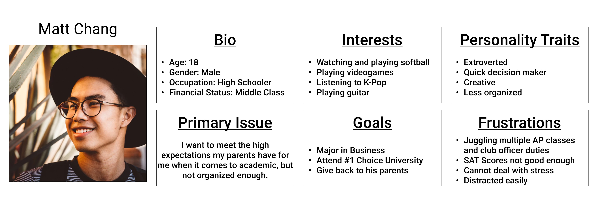
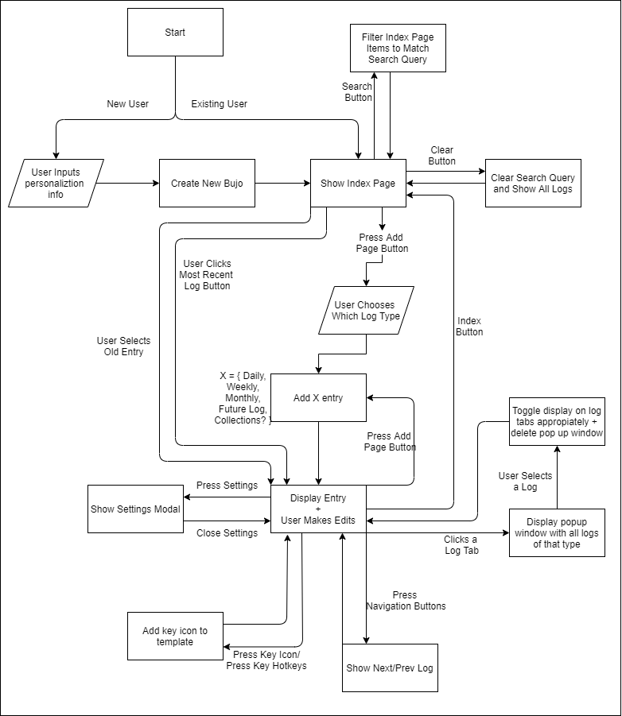

# **Starting Pitch**
## **Statement of Purpose**
We want to design a Bullet Journal app that gives our _**busy**_ users a way to make a **_digitally_** **_accessible_** journal that is **_flexible_** and disregards the **_time-consuming_** aspects of a physical journal.

---
## **"Appetite"**
In two weeks, we want to create a word processor embedded in a webpage, with the ability to create, write, and save unique pages.

*Figure 1. Initial wireframe of interface*

---
## **Solution**
### **User Personas**

---
### **High Fidelity Prototype Design**
*Home Page:* 

*Daily Log:* 

*Weekly Log:* 

*Monthly Log:* 

*Future Log:* 

---
### **System Diagram**

---
## **Risks and Rabbit Holes**
- Organization of files in the backend - unique url for each page vs. dynamically changing on a static url
- Where files will be stored: through cookies, local file storage, database
- Interactive Calendar Widget to chronologically navigate through journal

---

## **No-Gos (this sprint)**
- No custom templates
- No custom backgrounds/background colors
- No exporting files

